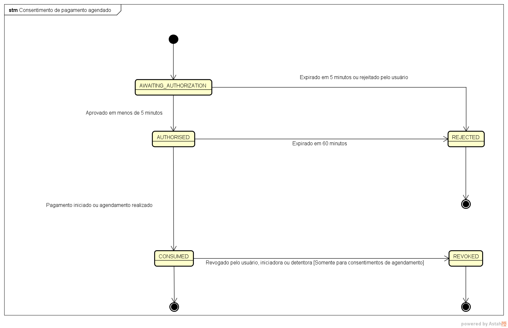
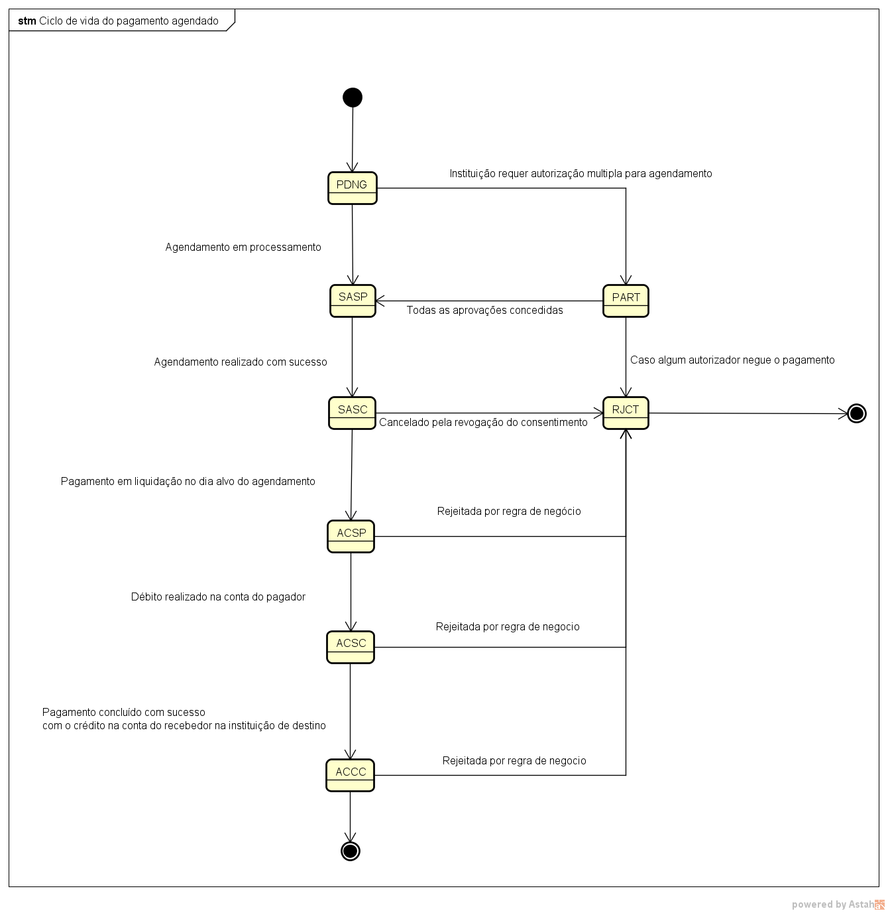
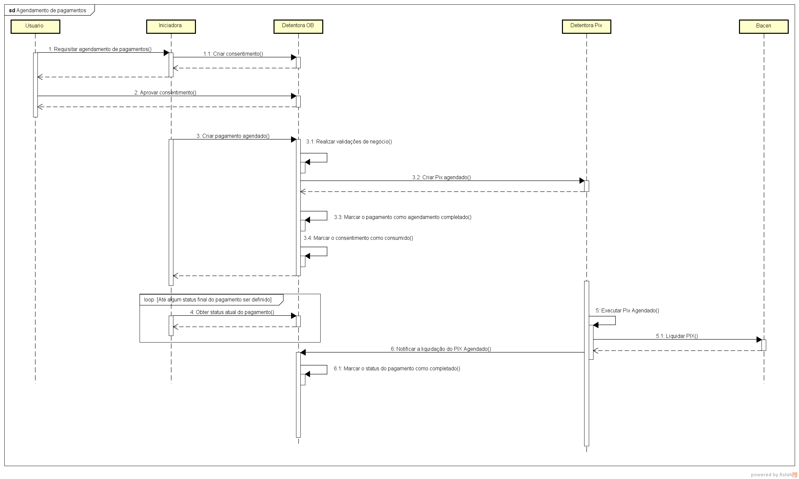

# Indices
- [Introdução](#introdução)
- [Ciclos de vida](#ciclo-de-vida-de-consentimentos-e-pagamentos-agendados)
  - [Consentimento](#consentimento)
  - [Pagamento](#pagamento)
- [Controle de Acesso](#controle-de-acesso)
- [Agendamento de pagamentos](#agendamento-de-pagamentos)
  - [Jornada](#jornada)
  - [Endpoints](#endpoints)
    - [Criar consentimento](#criar-consentimento)
    - [Consultar consentimento](#consultar-consentimento)
    - [Criar pagamento PIX](#criar-pagamento-pix)
    - [Consultar pagamento PIX](#consultar-pagamento-pix)
  - [Mecanismo de retentativas de liquidação de pagamentos agendados](#mecanismo-de-retentativas-de-liquidao-de-pagamentos-agendados)
- [Revogação do consentimento](#revogao-do-consentimento)
  - [Endpoints](#endpoint)
    - [Revogar consentimento](#revogar-consentimento)
    - [Consultar consentimento](#consultar-consentimento-revogado)
    - [Consultar pagamento agendado PIX](#consultar-pagamento-pix)
- [Regra de negócio](#regras-de-negcio)
 
  
# Introdução
  Esta proposta visa adicionar suporte a agendamento de pagamentos para datas futuras tendo como 
  alvo inicial o suporte a pagamento agendados para o arranjo Pix, contudo pavimentando a possibilidade
  de adição de semelhante funcionalidade a outros meios de pagamentos posteriormente.  
  Toda a proposta fora escrita tendo o controle do mecanismo de agendamento junto as detentoras de contas.

# Ciclo de vida de consentimentos e pagamentos agendados

  Para suportar a funcionalidade de agendamento serão necessárias alterações nas máquinas de estado dos recursos de consentimento e pagamentos.  
  
## Consentimento 
  Para suportar a possibilidade de revogação do consentimento o novo status **REVOKED** será adicionado ao schema: [EnumAuthorisationStatusType](https://openbanking-brasil.github.io/areadesenvolvedor/#tocS_EnumAuthorisationStatusType).  
  O status **CONSUMED** do consentimento não será mais um estado final em consentimentos para pagamentos agendados,
  pois poderá ser alterado para o novo status **REVOKED** caso algum dos participantes da transação (Usuário final, Iniciadora ou Detentora) 
  decida por cancelar o pagamento antes de ser liquidado.  

  

## Pagamento
  Para suportar a noção de agendamento serão adicionados dois novos status ao recurso de pagamentos pix listados abaixo o schema: [EnumPaymentStatusType](https://openbanking-brasil.github.io/areadesenvolvedor/#tocS_EnumPaymentStatusType).
  1. **SASP (SCHEDULE_ACCEPTED_SETTLEMENT_IN_PROCESS)** 
  2. **SASC (SCHEDULE_ACCEPTED_SETTLEMENT_COMPLETED)**  

  Estes dois novos status indicam respectivamente que o processo de agendamento está em processamento e o segundo que o agendamento foi realizado.  
  O primeiro status faculta a possibilidade das detentoras implementarem um fluxo assíncrono de agendamento.  
  No dia alvo do agendamento o pagamento será liquidado com os preceitos já estabelecidos da máquina estados do pagamento.  

  

# Controle de acesso
  A funcionalidade agendamento não introduz novas necessidades de controle de acesso ao que já é praticado na modalidade de pagamentos normais.  
  Nesta sessão apenas gostaríamos de ratificar que o controle do tempo de vida máximo dos access tokens obtidos pelo processo de hybrid flow estão vinculados
  ao tempo de expiração do consentimento. Esta premissa será especialmente útil a funcionalidade de agendamento que estende o tempo de expiração do consentimento
  até o último instante do dia alvo da liquidação do pagamento.

# Agendamento de pagamentos
  A funcionalidade de agendamento proposta apenas permite agendamentos para pagamentos únicos, ou seja, sem recorrência.  
  O suporte a recorrência será estudado no futuro caso haja necessidade.  

## Jornada
  A jornada para realizar agendamentos de pagamentos fundamentalmente é semelhante à jornada de um pagamento normal  
  facilitando o processo de suporte a funcionalidade.

  

## Endpoints

   Para suportar o agendamento todos os endpoints envolvidos no processo de pagamentos normais sofrerão alterações.  

### Criar consentimento
  
  **POST /payments/v1/consents**
  
  Os consentimentos criados por este endpoint terão a adição de novo objeto que írá conter os dados do agendamento conforme descrito adiante. 
  
  **Fragmento do consentimento com a estrutura do objeto de agendamento**
```
{
   "data":{
      "payment":{
         "type":"PIX",
         "schedule":{
            "single":{
               "date":"2035-01-01"
            }
         }
      }
   }
}
```
  Campo **schedule** foi adicionado para permitir que o novo objeto de agendamento seja descrito.  
  Descrição dos campos:  
  
  |**Campo**|**Tipo**|**Requerido**|**Descrição**|Regras de negócio|
  |----------|------|---------|--------------------------------------------------------|---------|
  |**data.payment.schedule**|objeto|condicionalmente|Define o agendamento do pagamento. Utilizado somente na funcionalidade de agendamento de pagamentos|[RN100](#regras-de-validação)|
  |**data.payment.schedule.single**|objeto|sim|Define a política de agendamento único|N/A|
  |**data.payment.schedule.single.date**|string(date)|sim|Define a data alvo da liquidação do pagamento|[RN101](#regras-de-validação)|
  
   **Regras de negócio**
   1. [RN001](#regras-funcionais)

### Consultar consentimento
  
  **GET /payments/v1/consents/{consentId}**

  Todos os novos dados mencionados no endpoint de criação do consentimento também estarão presentes na resposta positiva deste endpoint.  
  
### Criar pagamento pix

  **POST /payments/v1/pix/payments**
  
  Nenhuma mudança estrutural neste endpoint será feita para realizar o agendamento. Apenas será incluído os novos status conforme descrito em [Ciclo de vida](#ciclo-de-vida-de-consentimentos-e-pagamentos-agendados)  
  
### Consultar pagamento PIX
  
  **GET /payments/v1/pix/payments/{paymentId}**

  Nenhuma mudança estrutural neste endpoint será feita para realizar o agendamento. Apenas será incluído os novos status conforme descrito em [Ciclo de vida](#ciclo-de-vida-de-consentimentos-e-pagamentos-agendados)

## Mecanismo de retentativas de liquidação de pagamentos agendados

  No momento da liquidação de pagamentos agendados é possível ter falhas sistêmicas ou violações de regras de negócio passiveis de recuperação em segundo momento 
  como, por exemplo, ausência de saldo na conta do pagador para realizar a liquidação. Neste contexto poderia ser interessante as detentoras de conta a adoção de políticas de retentativa de liquidação.  
  O arranjo PIX no define nada a respeito deste tema, então por consequência o Open Banking deixa livre para cada detentora adotar a política
  de retentativa que mais fazer sentido para ela. 

# Revogação do consentimento

  Com a inclusão da funcionalidade agendamento é interessante facultar para as partes envolvidas na transação a possibilidade de cancelamento do pagamento agendado antes da sua liquidação futura.  
  Esse mecanismo de cancelamento do pagamento agendado será oferecido a partir da revogação de consentimentos para pagamentos agendados.
  Considerando a diretriz do controle do agendamento pela detentora de conta e as necessidades dos envolvidos na transação e possível as seguintes possibilidades de jornadas de revogação.

1. Revogação **pelo usuário na iniciadora** na área de gestão de pagamentos do open banking (Consulte o guia de UX do Open Banking para maiores detalhes) 
2. Revogação **pelo usuário na detentora** na área de gestão de pagamentos do open banking (Consulte o guia de UX do Open Banking para maiores detalhes)
3. Revogação **pelo usuário na detentora** na área de gestão de Pix (Consulte o guia de UX do arranjo PIX para maiores detalhes)
4. Revogação pela iniciadora sem a presença do usuário
5. Revogação pela detentora sem a presença do usuário

## Endpoint
  Para incluir a funcionalidade revogação do consentimento será necessário a inclusão de um novo endpoint e a alteração do endpoint de consulta do consentimento descritos a seguir.
  Os dados do consentimento terão uma expansão para capturar as circunstâncias da revogação tornando claro ocorrido para todas as partes envolvidas.

### Revogar consentimento

  **PATCH /payments/v1/consents/{consentId}**  
 
  **Parâmetros**  

  |Nome|Origem|Tipo|Requerido|Descrição|
  |-----------------|----------|------------|---------|---------------------------------------------------------------------------------------------------------------------------|
  |**consentId**|path|string|sim|O consentId é o identificador único do consentimento a ser revogado e deverá ser um URN - Uniform Resource Name.|
  |**Authorization**|header|string|sim|Cabeçalho HTTP padrão. Permite que as credenciais sejam fornecidas dependendo do tipo de recurso solicitado.|
  |**x-fapi-auth-date**|header|string|não|Data em que o usuário logou pela última vez com o receptor. Representada de acordo com a RFC7231.Exemplo: Sun, 10 Sep 2017 19:43:31 UTC|
  |**x-fapi-customer-ip-address**|header|string|não|O endereço IP do usuário se estiver atualmente logado com o receptor.|
  |**x-fapi-interaction-id**|header|string|não|Um UID RFC4122 usado como um ID de correlação. Se fornecido, o transmissor deve "reproduzir" esse valor no cabeçalho de resposta.|
  |**x-idempotency-key**|header|string|sim|Cabeçalho HTTP personalizado. Identificador de solicitação exclusivo para suportar a idempotência.|
  |**x-customer-user-agent**|header|string|não|Indica o user-agent que o usuário utiliza.|
  
  **Payload de requisição**

```
{
   "data":{
      "status":"REVOKED",
      "revocation":{
         "loggedUser":{
            "document":{
               "identification":"11111111111",
               "rel":"CPF"
            }
         },
         "businessEntity":{
            "document":{
               "identification":"11111111111111",
               "rel":"CNPJ"
            }
         },
         "revoked_by":"USER",
         "reason":{
            "code":"OTHER",
            "additionalInformation":"Não quero mais o serviço"
         }
      }
   }
}
```
  **Descrição dos campos**

  |**Campo**|**Tipo**|**Requerido**|**Descrição**|Regras de negócio|
  |----------|------|---------|---------------------------------------------------------------------------------------------------------------|---------|
  |**data.status**|enumerado(string) - [EnumAuthorisationStatusType](https://openbanking-brasil.github.io/areadesenvolvedor/#tocS_EnumAccountPaymentsType)|sim|Status para qual o consentimento seguirá. Apenas o valor **REVOKED** será suportado no momento|[RN100](#regras-de-validação)|
  |**data.revocation**|objeto|sim|Objeto que contém as informações das circunstância da revogação|N/A|
  |**data.revocation.loggedUser**|objeto|condicionalmente|Representa o usuário (pessoa natural) que encontra-se logado na instituição Iniciadora de Pagamento.|[RN103](#regras-de-validação),[RN104](#regras-de-validação)|
  |**data.revocation.loggedUser.document**|objeto|sim|Objeto que contém os dados de identificação do usuário.|N/A|
  |**data.revocation.loggedUser.document.identification**|string|sim|Número do documento de identificação oficial do usuário.|N/A|
  |**data.revocation.loggedUser.document.rel**|string|sim|Tipo do documento de identificação oficial do usuário.|N/A|
  |**data.revocation.businessEntity**|objeto|condicionalmente|Usuário (pessoa jurídica) que encontra-se logado na instituição Iniciadora de Pagamento. Preenchimento obrigatório se usuário logado na instituição Iniciadora de Pagamento for um CNPJ (pessoa jurídica).|[RN103](#regras-de-validação),[RN104](#regras-de-validação)|
  |**data.revocation.businessEntity.document**|objeto|sim|Objeto que contém os dados de identificação do usuário.|N/A|
  |**data.revocation.businessEntity.document.identification**|string|sim|Número do documento de identificação oficial do usuário.|N/A|
  |**data.revocation.businessEntity.document.rel**|string|sim|Tipo do documento de identificação oficial do usuário.|N/A|
  |**data.revocation.revoked_by**|enumerado(string)|sim|Define qual das partes envolvidas na transação está realizando a revogação. Valores possíveis: **USER** (Revogado pelo usuário), **ACCOUNT_HOLDER** (Dententora de conta), **INITIATOR** (iniciadora de pagamentos).|N/A|
  |**data.revocation.reason**|objeto|sim|Define a razão pela qual o consentimento foi revogado|N/A|
  |**data.revocation.reason.code**|enumerado(string)|sim|Define o código da razão pela qual o consentimento foi revogado. Valores possíveis: **FRAUD** (Indica suspeita de fraude), **ACCOUNT_CLOSURE** (Indica que a conta do usuário foi encerrada), **OTHER** (Indica que motivo do cancelamento está fora dos motivos pré-estabelecidos) |[RN108](#regras-de-validação)|
  |**data.revocation.reason.additionalInformation**|string|condicionalmente|Contém informações adicionais definidas pelo requisitante da revogação|[RN109](#regras-de-validação)|

  **Controle de acesso**

  Este endpoint deve suportar tanto ser chamado usando client credentials ou tokens oriundos do processo de hybrid flow.

  **Regras de negócio**

  1.[RN002](#regras-funcionais)

### Consultar consentimento revogado

  **GET /payments/v1/consents/{consentId}**  

  Todos os novos dados mencionados no endpoint de revogação do consentimento também estarão presentes na resposta positiva deste endpoint.

### Consultar pagamento agendado PIX

**GET /payments/v1/pix/payments/{paymentId}**

Nenhuma mudança estrutural neste endpoint será feita para realizar a revogação.  
Apenas será incluído um novo motivo de rejeição: **CONSENT_REVOKED** para mostrar que o pagamento foi cancelado devido à revogação do consentimento.
os novos status conforme descrito em [Ciclo de vida](#ciclo-de-vida-de-consentimentos-e-pagamentos-agendados)


## Regras de negócio
    
  Nesta sessão serão listadas todas as regras de negócio envolvidas nos endpoints citados nas sessões anteriores.

### Regras funcionais

|**Código**|**Descrição**|Endpoint|
|----------|-----------------------------------------------------------------------------------------------------------|------------|
|**RN001**|Ao criar um consentimento para pagamentos agendados o campo **expirationDateTime** do schema [ResponsePaymentConsent](https://openbanking-brasil.github.io/areadesenvolvedor/#tocS_ResponsePaymentConsent) deve receber o último segundo da data alvo de liquidação do pagamento. Ex: 2021-05-21T23:59:59Z|[Criar consentimento](#criar-consentimento)|
|**RN002**|Ao revogar um consentimento o pagamento associado deverá ir para o status **RJCT** e campo **rejectionReason** deverá ter o valor **CONSENT_REVOKED**. Schema: [EnumRejectionReasonType](https://openbanking-brasil.github.io/areadesenvolvedor/#tocS_EnumRejectionReasonType) |[Revogar consentimento](#revogar-consentimento)|


### Regras de validação

|**Código**|**Descrição**|Endpoint|Resposta HTTP|Código de Erro|Título|Mensagem|Schema|
|----------|------------------------------------------------------------------------------------------------------------------------------------------|-----------------|-------|----------------|--------------------------|-----------------------------|--------------------------|
|**RN100**|Os campos **data.payment.schedule** e **data.payment.date** são mutuamente exclusivos|[Criar consentimento](#criar-consentimento)|400|Livre|Livre|Livre|[ResponseError](https://openbanking-brasil.github.io/areadesenvolvedor/#tocS_ResponseError)|
|**RN101**|O campo **data.payment.schedule.date** deverá sempre ser no mínimo D+1 corrido, ou seja, a data imediatamente posterior em relação a data do consentimento|[Criar consentimento](#criar-consentimento)|422|**INVALID_SCHEDULE**|Agendamento inválido|Agendamento inválido|[422ResponseErrorCreateConsent](https://openbanking-brasil.github.io/areadesenvolvedor/#tocS_422ResponseErrorCreateConsent)|
|**RN102**|O campo **data.status** na revogação do consentimento só deverá aceitar o valor **REVOKED**|[Revogar consentimento](#revogar-consentimento)|400|Livre|Livre|Livre|[ResponseError](https://openbanking-brasil.github.io/areadesenvolvedor/#tocS_ResponseError)|
|**RN103**|Os campos **data.revocation.loggedUser** e **data.revocation.businessEntity** são mutuamente exclusivos|[Revogar consentimento](#revogar-consentimento)|400|Livre|Livre|Livre|[ResponseError](https://openbanking-brasil.github.io/areadesenvolvedor/#tocS_ResponseError)|
|**RN104**|O campo **data.revocation.loggedUser** ou **data.revocation.businessEntity** devem se preenchidos quando a revogação for feita pelo usuário final, ou seja, se o campo **data.revocation.revoked_by** estiver com o valor **USER**|422|USER_INFORMATION_REQUIRED|Informação do usuário requerida|Informação do usuário requerida|[422ResponseErrorCreateConsent](https://openbanking-brasil.github.io/areadesenvolvedor/#tocS_422ResponseErrorCreateConsent)|
|**RN105**|O consentimento só pode ser revogado nos status **CONSUMED**|[Revogar consentimento](#revogar-consentimento)|422|OPERATION_NOT_ALLOWED_BY_STATUS|Operação não permitida|Operação não permitida devido ao status atual do consentimento|[422ResponseErrorCreateConsent](https://openbanking-brasil.github.io/areadesenvolvedor/#tocS_422ResponseErrorCreateConsent)|
|**RN106**|Somente consentimentos para pagamentos agendados podem ser revogados, ou seja, que possuam o campo **data.payment.schedule** preenchido|[Revogar consentimento](#revogar-consentimento)|422|OPERATION_NOT_SUPPORTED_BY_CONSENT_TYPE|Operação não permitida|Operação não suportada pelo tipo de consentimento|[422ResponseErrorCreateConsent](https://openbanking-brasil.github.io/areadesenvolvedor/#tocS_422ResponseErrorCreateConsent)|
|**RN107**|O consentimento só pode ser revogado até o dia anterior, ou seja, a meia noite no fuso horário de Brasília do dia imediatamente anterior a data alvo da liquidação do pagamento|[Revogar consentimento](#revogar-consentimento)|422|REVOCATION_TIME_LIMIT_EXCEEDED|Prazo limite para revogação excedido|Prazo limite para revogação excedido|[422ResponseErrorCreateConsent](https://openbanking-brasil.github.io/areadesenvolvedor/#tocS_422ResponseErrorCreateConsent)|
|**RN108**|Os motivos de revogação do consentimento: **FRAUD** e **ACCOUNT_CLOSURE** só podem ser usados caso o campo: **data.revocation.revoked_by** tenha o valor **INITIATIOR** ou **ACCOUNT_HOLDER**, ou seja, somente no caso de revogação unilateral pela iniciadora ou detentora|[Revogar consentimento](#revogar-consentimento)|422|REVOCATION_REASON_NOT_ALLOWED|Motivo de revogação não permitido|Motivo de revogação não permitido|[422ResponseErrorCreateConsent](https://openbanking-brasil.github.io/areadesenvolvedor/#tocS_422ResponseErrorCreateConsent)|
|**RN109**|O campo **data.revocation.reason.additionalInformation** é obrigatório quando o motivo de revogação for **OTHER**|[Revogar consentimento](#revogar-consentimento)|422|REVOCATION_ADDITIONAL_INFORMATION_REQUIRED|Informação adicional requerida|Informação adicional requerida|[422ResponseErrorCreateConsent](https://openbanking-brasil.github.io/areadesenvolvedor/#tocS_422ResponseErrorCreateConsent)|
|**RN110**|Apenas quando o consentimento for revogado pelo usuário, ou seja, o campo **data.revocation.revoked_by** for **USER** o access token conseguido via hybrid flow deverá ser usado para realizar a requisição|[Revogar consentimento](#revogar-consentimento)|403|LIVRE|LIVRE|LIVRE|[ResponseError](https://openbanking-brasil.github.io/areadesenvolvedor/#tocS_ResponseError)|
